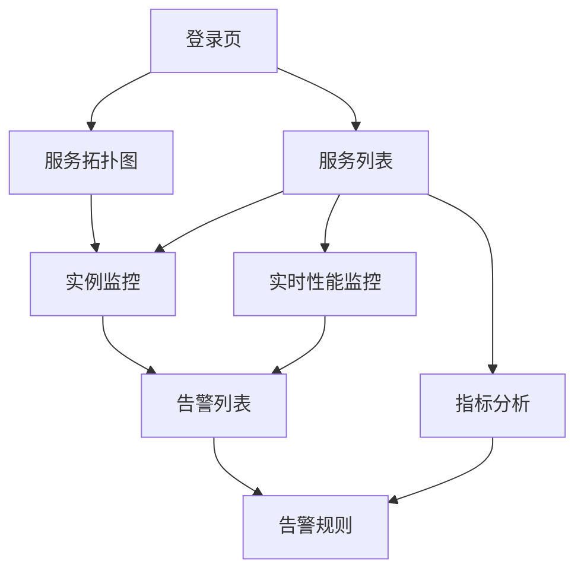

## 1. 产品概述
StarLight是一款现代化的微服务监控应用，提供桌面端和移动端双平台支持。该应用帮助开发者和运维人员实时监控微服务架构的健康状态、性能指标和异常情况，通过直观的可视化界面提升服务管理效率。

目标用户包括DevOps工程师、系统管理员、开发团队负责人等需要监控微服务运行状态的技术人员。产品价值在于降低微服务运维复杂度，提高故障发现和处理的及时性。

## 2. 核心功能

### 2.1 用户角色
| 角色 | 注册方式 | 核心权限 |
|------|----------|----------|
| 系统管理员 | 后台创建 | 全功能访问、系统配置、用户管理 |
| 运维工程师 | 邮箱注册 | 服务监控、告警管理、性能分析 |
| 开发工程师 | 邮箱注册 | 服务查看、日志查看、只读权限 |
| 访客用户 | 临时访问 | 基础监控查看、无配置权限 |

### 2.2 功能模块
我们的微服务监控应用包含以下核心页面：

1. **服务拓扑图**：可视化展示微服务间的调用关系和依赖拓扑，支持实时状态展示和故障定位。
2. **服务列表**：展示所有微服务的运行状态、健康度、响应时间等关键指标，支持筛选和搜索。
3. **实例监控**：监控具体服务实例的运行状态、资源使用情况、线程池状态等详细信息。
4. **实时性能监控**：展示系统各项性能指标的实时变化趋势，包括CPU、内存、网络、磁盘等。
5. **指标分析**：提供多维度的性能指标分析，支持自定义时间范围和对比分析。
6. **告警列表**：展示系统产生的各类告警信息，支持分级展示和快速处理。
7. **告警规则**：配置和管理告警触发规则，支持自定义阈值和通知方式。

### 2.3 页面详情
| 页面名称 | 模块名称 | 功能描述 |
|----------|----------|----------|
| 服务拓扑图 | 拓扑可视化 | 展示服务间调用关系图，支持拖拽、缩放、节点点击查看详情，实时更新服务状态 |
| 服务拓扑图 | 依赖分析 | 分析服务依赖层级，识别关键路径和潜在风险点 |
| 服务列表 | 服务概览 | 列表展示所有服务名称、状态、响应时间、错误率等核心指标 |
| 服务列表 | 快速筛选 | 支持按状态、标签、关键词等条件快速筛选服务 |
| 服务列表 | 批量操作 | 支持批量启停服务、导出服务状态报告 |
| 实例监控 | 实例详情 | 展示单个服务实例的详细运行状态和性能指标 |
| 实例监控 | 资源监控 | 实时监控实例的CPU、内存、线程、连接池等资源使用情况 |
| 实例监控 | 健康检查 | 展示健康检查结果和历史趋势，支持自定义检查规则 |
| 实时性能监控 | 指标看板 | 实时展示系统各项性能指标的变化趋势 |
| 实时性能监控 | 图表配置 | 支持自定义图表类型、时间范围、刷新频率 |
| 指标分析 | 历史分析 | 提供历史数据的多维度分析和对比功能 |
| 指标分析 | 报表生成 | 支持生成和导出各类性能分析报表 |
| 告警列表 | 告警概览 | 列表展示所有告警信息，支持按级别、时间、服务筛选 |
| 告警列表 | 告警处理 | 支持告警确认、处理、转派等操作 |
| 告警列表 | 告警统计 | 提供告警趋势统计和频发问题分析 |
| 告警规则 | 规则配置 | 配置告警触发条件和阈值 |
| 告警规则 | 通知设置 | 配置告警通知方式和接收人 |

## 3. 核心流程

### 系统管理员流程
1. 登录系统 → 配置数据源 → 添加服务 → 配置告警规则 → 分配用户权限 → 监控系统运行

### 运维工程师流程
1. 登录系统 → 查看服务拓扑 → 监控性能指标 → 处理告警信息 → 生成运维报告

### 开发工程师流程
1. 登录系统 → 查看服务状态 → 分析性能指标 → 查看日志信息 → 定位问题原因

### 页面导航流程

## 4. 用户界面设计

### 4.1 设计风格
- **主色调**：深蓝色(#1E3A8A)为主，橙色(#F97316)为强调色，灰色系为辅助色
- **按钮风格**：圆角矩形设计，主要操作为实心填充，次要操作为边框样式
- **字体规范**：主标题24px加粗，正文14px常规，小字12px，代码字体使用等宽字体
- **布局风格**：左侧导航栏+右侧内容区域的经典布局，支持标签页切换
- **图标风格**：使用Ionicons图标库，线性风格，统一尺寸和颜色

### 4.2 页面设计概览
| 页面名称 | 模块名称 | UI元素 |
|----------|----------|----------|
| 服务拓扑图 | 拓扑可视化 | 深色背景，服务节点使用圆形图标，连接线根据状态显示不同颜色，支持悬停显示详情卡片 |
| 服务列表 | 服务概览 | 卡片式布局，每行展示服务信息，状态指示灯显示运行状态，支持展开查看详情 |
| 实例监控 | 实例详情 | 网格布局展示各项指标，使用仪表盘组件显示关键指标，图表使用平滑曲线 |
| 实时性能监控 | 指标看板 | 多图表组合展示，支持全屏查看，图表颜色统一使用蓝色系渐变 |
| 告警列表 | 告警概览 | 表格形式展示，不同级别使用不同背景色，紧急告警使用红色高亮 |

### 4.3 响应式设计
- **桌面端优先**：针对1920x1080分辨率优化设计
- **移动端适配**：支持平板和手机端访问，采用响应式布局
- **触摸优化**：移动端支持手势操作，按钮大小适配触摸交互

### 4.4 数据可视化指导
- **图表类型**：折线图展示趋势，柱状图展示对比，饼图展示占比
- **颜色方案**：使用统一的配色方案，避免过于鲜艳的颜色
- **动画效果**：图表加载和数据更新使用平滑过渡动画
- **交互设计**：支持数据点悬停显示详情，图表缩放和拖拽