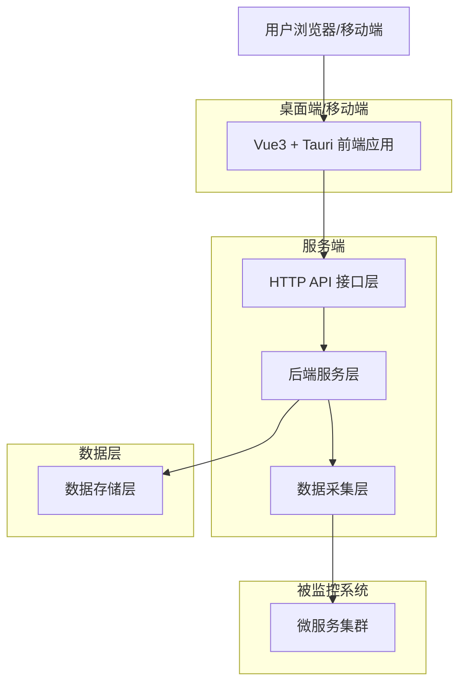
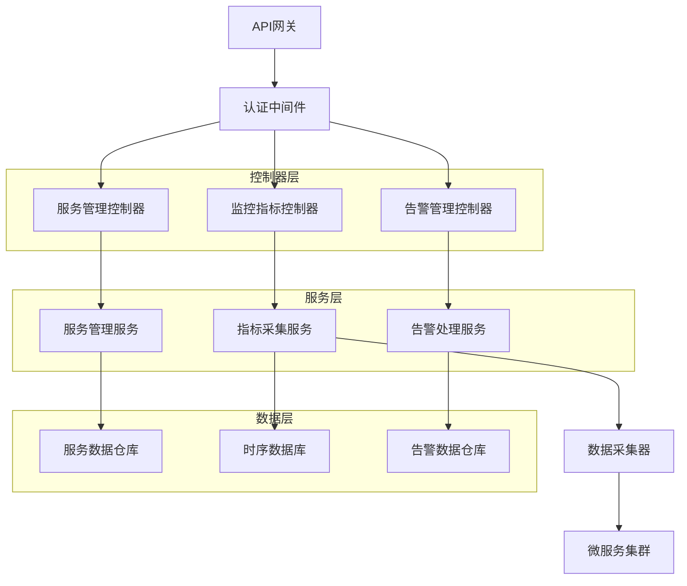
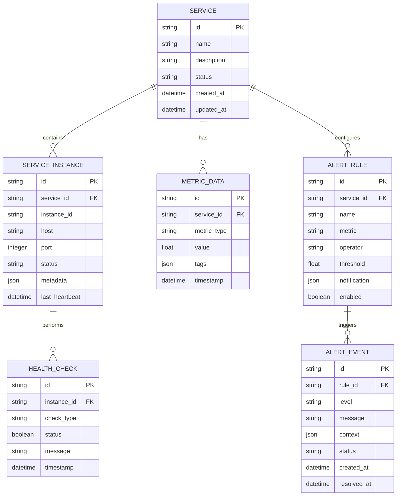

## 1. 架构设计



## 2. 技术描述

- **前端框架**: Vue3@3.5 + TypeScript + Tauri@2.0
- **初始化工具**: Vite
- **UI组件库**: NaiveUI@2.41
- **状态管理**: Pinia@3.0 + pinia-plugin-persistedstate
- **样式方案**: UnoCSS + Sass
- **移动端支持**: Tauri移动端插件(iOS/Android)
- **后端服务**: 预留接口层，支持Node.js/Go/Java技术栈
- **数据存储**: Supabase(PostgreSQL) + Redis缓存
- **数据采集**: 预留集成Prometheus、Grafana、Zipkin等监控组件

## 3. 路由定义

| 路由 | 用途 |
|------|------|
| /home/service-topology | 服务拓扑图页面，展示微服务调用关系 |
| /home/service-list | 服务列表页面，展示所有服务状态 |
| /home/instance-monitor | 实例监控页面，监控具体服务实例 |
| /home/real-time-monitor | 实时性能监控页面，展示系统性能指标 |
| /home/metrics-analysis | 指标分析页面，提供历史数据分析 |
| /home/alert-list | 告警列表页面，展示系统告警信息 |
| /home/alert-rules | 告警规则页面，配置告警触发条件 |
| /mobile/login | 移动端登录页面 |
| /mobile/home | 移动端主页 |

## 4. API定义

### 4.1 核心API接口

#### 服务管理相关
```
GET /api/services
```

请求参数:
| 参数名 | 参数类型 | 是否必需 | 描述 |
|--------|----------|----------|------|
| page | number | false | 页码，默认为1 |
| pageSize | number | false | 每页数量，默认为20 |
| status | string | false | 服务状态筛选(active/inactive/error) |
| keyword | string | false | 服务名称关键词搜索 |

响应数据:
| 参数名 | 参数类型 | 描述 |
|--------|----------|------|
| services | array | 服务列表数据 |
| total | number | 服务总数 |
| page | number | 当前页码 |

```json
{
  "services": [
    {
      "id": "service-001",
      "name": "用户服务",
      "status": "active",
      "responseTime": 120,
      "errorRate": 0.01,
      "instances": 3
    }
  ],
  "total": 25,
  "page": 1
}
```

#### 性能指标相关
```
GET /api/metrics
```

请求参数:
| 参数名 | 参数类型 | 是否必需 | 描述 |
|--------|----------|----------|------|
| serviceId | string | true | 服务ID |
| metricType | string | true | 指标类型(cpu/memory/network) |
| timeRange | string | false | 时间范围(1h/6h/24h/7d) |

#### 告警相关
```
GET /api/alerts
```

请求参数:
| 参数名 | 参数类型 | 是否必需 | 描述 |
|--------|----------|----------|------|
| level | string | false | 告警级别(critical/warning/info) |
| status | string | false | 告警状态(open/acknowledged/resolved) |
| serviceId | string | false | 服务ID筛选 |

```
POST /api/alerts/rules
```

请求体:
| 参数名 | 参数类型 | 是否必需 | 描述 |
|--------|----------|----------|------|
| name | string | true | 规则名称 |
| metric | string | true | 监控指标 |
| threshold | number | true | 阈值 |
| operator | string | true | 比较运算符 |
| notification | object | true | 通知配置 |

## 5. 服务端架构设计



## 6. 数据模型

### 6.1 数据模型定义



### 6.2 数据定义语言

#### 服务表 (services)
```sql
-- 创建服务表
CREATE TABLE services (
    id UUID PRIMARY KEY DEFAULT gen_random_uuid(),
    name VARCHAR(100) NOT NULL UNIQUE,
    description TEXT,
    status VARCHAR(20) DEFAULT 'inactive' CHECK (status IN ('active', 'inactive', 'error', 'warning')),
    metadata JSONB DEFAULT '{}',
    created_at TIMESTAMP WITH TIME ZONE DEFAULT NOW(),
    updated_at TIMESTAMP WITH TIME ZONE DEFAULT NOW()
);

-- 创建索引
CREATE INDEX idx_services_status ON services(status);
CREATE INDEX idx_services_created_at ON services(created_at DESC);
```

#### 服务实例表 (service_instances)
```sql
-- 创建服务实例表
CREATE TABLE service_instances (
    id UUID PRIMARY KEY DEFAULT gen_random_uuid(),
    service_id UUID REFERENCES services(id) ON DELETE CASCADE,
    instance_id VARCHAR(100) NOT NULL,
    host VARCHAR(255) NOT NULL,
    port INTEGER NOT NULL,
    status VARCHAR(20) DEFAULT 'unknown' CHECK (status IN ('healthy', 'unhealthy', 'unknown')),
    metadata JSONB DEFAULT '{}',
    last_heartbeat TIMESTAMP WITH TIME ZONE DEFAULT NOW(),
    created_at TIMESTAMP WITH TIME ZONE DEFAULT NOW(),
    UNIQUE(service_id, instance_id)
);

-- 创建索引
CREATE INDEX idx_service_instances_service_id ON service_instances(service_id);
CREATE INDEX idx_service_instances_status ON service_instances(status);
CREATE INDEX idx_service_instances_last_heartbeat ON service_instances(last_heartbeat DESC);
```

#### 指标数据表 (metrics)
```sql
-- 创建指标数据表
CREATE TABLE metrics (
    id UUID PRIMARY KEY DEFAULT gen_random_uuid(),
    service_id UUID REFERENCES services(id) ON DELETE CASCADE,
    metric_type VARCHAR(50) NOT NULL,
    metric_name VARCHAR(100) NOT NULL,
    value FLOAT NOT NULL,
    unit VARCHAR(20),
    tags JSONB DEFAULT '{}',
    timestamp TIMESTAMP WITH TIME ZONE DEFAULT NOW()
);

-- 创建索引
CREATE INDEX idx_metrics_service_id ON metrics(service_id);
CREATE INDEX idx_metrics_metric_type ON metrics(metric_type);
CREATE INDEX idx_metrics_timestamp ON metrics(timestamp DESC);
CREATE INDEX idx_metrics_service_timestamp ON metrics(service_id, timestamp DESC);
```

#### 告警规则表 (alert_rules)
```sql
-- 创建告警规则表
CREATE TABLE alert_rules (
    id UUID PRIMARY KEY DEFAULT gen_random_uuid(),
    service_id UUID REFERENCES services(id) ON DELETE CASCADE,
    name VARCHAR(100) NOT NULL,
    description TEXT,
    metric VARCHAR(50) NOT NULL,
    operator VARCHAR(10) NOT NULL CHECK (operator IN ('>', '<', '>=', '<=', '==', '!=')),
    threshold FLOAT NOT NULL,
    duration INTEGER DEFAULT 0, -- 持续时间(秒)
    severity VARCHAR(20) DEFAULT 'warning' CHECK (severity IN ('info', 'warning', 'critical')),
    notification_config JSONB DEFAULT '{}',
    enabled BOOLEAN DEFAULT true,
    created_at TIMESTAMP WITH TIME ZONE DEFAULT NOW(),
    updated_at TIMESTAMP WITH TIME ZONE DEFAULT NOW()
);

-- 创建索引
CREATE INDEX idx_alert_rules_service_id ON alert_rules(service_id);
CREATE INDEX idx_alert_rules_enabled ON alert_rules(enabled);
```

#### 告警事件表 (alert_events)
```sql
-- 创建告警事件表
CREATE TABLE alert_events (
    id UUID PRIMARY KEY DEFAULT gen_random_uuid(),
    rule_id UUID REFERENCES alert_rules(id) ON DELETE CASCADE,
    service_id UUID REFERENCES services(id) ON DELETE CASCADE,
    severity VARCHAR(20) NOT NULL,
    title VARCHAR(200) NOT NULL,
    message TEXT,
    context JSONB DEFAULT '{}',
    status VARCHAR(20) DEFAULT 'open' CHECK (status IN ('open', 'acknowledged', 'resolved')),
    acknowledged_by UUID,
    acknowledged_at TIMESTAMP WITH TIME ZONE,
    resolved_at TIMESTAMP WITH TIME ZONE,
    created_at TIMESTAMP WITH TIME ZONE DEFAULT NOW()
);

-- 创建索引
CREATE INDEX idx_alert_events_rule_id ON alert_events(rule_id);
CREATE INDEX idx_alert_events_service_id ON alert_events(service_id);
CREATE INDEX idx_alert_events_status ON alert_events(status);
CREATE INDEX idx_alert_events_created_at ON alert_events(created_at DESC);
CREATE INDEX idx_alert_events_severity ON alert_events(severity);
```

### 6.3 权限配置
```sql
-- 授予匿名用户基础查询权限
GRANT SELECT ON services TO anon;
GRANT SELECT ON service_instances TO anon;
GRANT SELECT ON metrics TO anon;
GRANT SELECT ON alert_rules TO anon;
GRANT SELECT ON alert_events TO anon;

-- 授予认证用户完整权限
GRANT ALL PRIVILEGES ON services TO authenticated;
GRANT ALL PRIVILEGES ON service_instances TO authenticated;
GRANT ALL PRIVILEGES ON metrics TO authenticated;
GRANT ALL PRIVILEGES ON alert_rules TO authenticated;
GRANT ALL PRIVILEGES ON alert_events TO authenticated;
```